## NOTICE

This work is licensed under the [Apache-2.0](https://www.apache.org/licenses/LICENSE-2.0).

- SPDX-License-Identifier: Apache-2.0
- Licence Path: https://creativecommons.org/licenses/by/4.0/legalcode
- Copyright (c) 2022, 2023 Contributors to the Eclipse Foundation
- Copyright (c) 2022, 2023 Bayerische Motoren Werke Aktiengesellschaft (BMW AG)
- Source URL: https://github.com/eclipse-tractusx/vas-country-risk

**About arc42**

arc42, the template for documentation of software and system
architecture.

Template Version 8.1 EN. (based upon AsciiDoc version), May 2022

Created, maintained and © by Dr. Peter Hruschka, Dr. Gernot Starke and
contributors. See <https://arc42.org>.

# Introduction and Goals

### Initial Situation from Business View

Geographical risks become more relevant in VUCA times and User from Business need an excellent solution to fulfill their requirements. VUCA means volatile, uncertain, complex, and ambiguous. In VUCA times, situations can change quickly (e.g. Ukraine war).

The Business challenge is to have awareness towards their business partners just in time. Be it in ongoing business or in the initiation of business. From business side the user needs to know who they are dealing with. This is especially true for business partners in a different country.

The main part of the country risk score are information per country regarding corruption, political stability, economic risk and social and structural figures.

### Business Solution Target Group

Compliance, Legal, Purchasing, Customer Service or other Company functional departments, who work together with Business Partners.


### Challenges

- The data is not updated frequently. Risk assessments, for example, often are carried out once a year.
- Most risk assessments are carried out manually or semi manually.
- Risk assessments are usually based on only a few sources.
- Not all business partners are considered (due to manual effort)
- Special events can only be analysed reactively and are very time-consuming.
- Due to a large system landscape, a direct check of all business partners is not possible. Manual data consolidation must take place.
- Manual reconciliation is error-prone


### Benefit Hypothesis & Problem Statement

The benefit is to get to know your business partner or potential business partners better. Through more information better decisions can be made, like e.g. in a tender situation or from a marketing point of view.

- This Catena-X solution does not only integrate data from various sources but also matches this data with the existent business partners to enable a risk view towards your customer and supplier base.
- Reduced effort for target group
- Reduction of costs (internal & external)
- Reduction of own interfaces to external data sources, since these are set up and administered by a service provider.
- Company individual country risk assessments (Lists) can be integrated
- A dashboard will keep you up to date at any time.

## Requirements Overview
## Quality Goals

## Stakeholders

Role/Name       | Contact                                                                                                                           | Expectations
----------------|-----------------------------------------------------------------------------------------------------------------------------------| -----------
Member Company  | A company that participates in the Catena-X ecosystem (use-cases and data sharing).                                         | Participate in the overall value proposition/stream provided by Catena-X.
Company Admin   | A person that manages a single member companies integration into the dataspace on behalf of his employer.                   | Manage and monitor the proper integration and function of a member company within the Catena-X ecosystem.
Company User    | A person that acts within the provided functionality of Catena-X on behalf of his employer (that is a member company)       | Execute various permitted tasks on behalf of a member company the user is assigned to.


# Architecture Constraints

- Homogenous UI/UX design across all user facing elements.
- Run anywhere: can be deployed as a docker image, e. g. on Kubernetes (platform-independent, cloud, on prem or local).
- Modular design: core-components are loosely coupled.
- Freedom of choice for technology components stops where UX is negatively impacted.
  (currently under revision by the overall catena architecture round table)
- Roles & Rights Matrix: Roles & Rights Concept

## Roles Rights Management


There shall be 3 roles specific to the country risk application in the portal:

- Global Admin (Operating Environment)
- Company Admin User
- Company Standard User


There can be two more roles for now regarding what type of User this is, and they are:
- Customer
- Supplier

Each User can have none , one or both.
It will determine what columns we will see on the Table.


# System Scope and Context

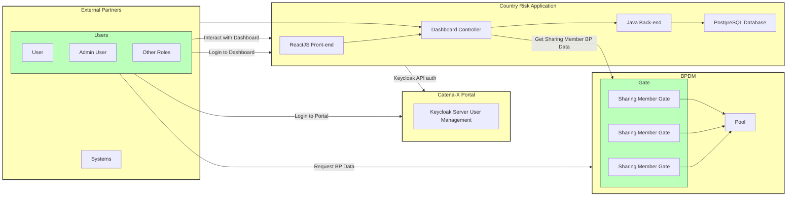


#### Example Data Sources

##### General

Diversifying the portfolio of a company across different countries can help to balance the potential volatility of conducting business in one economic region.

A country risk assessment can help a business to identify and evaluate country-specific risks. In doing so, businesses can determine how much those risks might impact their business and what steps they can take to manage or mitigate those risks.

Importance of Mitigating Country Risk

Evaluating country risk prior to making investments or conducting business in a country should be a critical part of a due diligence process. By relying on trusted sources of analysis and information, companies can get a strong idea of the potential risks these countries represent.

Ignoring country risk factors can lead to damaging consequences like:

- Catastrophic losses
- Failure to thrive
- Lawsuits
- Lack of transparency
- Theft (due to the perception of a lax attitude)

##### Types of Risk in International Business

There are many factors to consider, but those factors can largely be categorized as economic, political and social factors.

1. Economic Risk

- The stability and solvency of banks
- The short-, medium- and long-term outlook for country’s GDP and GNP
- Debt-to-GDP ratio
- Unemployment rate
- Overall government finances
- Monetary policy and currency stability
- Currency exchange rates
- Access to affordable capital


2. Political Risk

- Government instability
- Information access and transparency
- Terrorism, violence and crime
- Regulatory and policy environment
- Workforce freedom and mobility
- Government assistance programs for businesses
- Immigration and employment laws
- Attitudes toward foreign investment


3. Social & Structural Assessment

- Demographics
- Physical infrastructure
- Social infrastructure
- Labor force
- Competitors
- Treaty participation
- Export regulations
- Import acceptance from other countries
- Co-production opportunities with other nations


##### The globally available Scores in the Application are currently:

CPI Rating 2021
CPI Rating 2020
All underlying CPI Scores 2021
Basel Score 2021
Basel Score 2020

They are currently calculated like this:

Corruption Perception Index	0 - 100 ascending (0 - negative; 100 - positiv)

AML Basel List
10 - 0.00 descending (10 - negative; 0 positiv)

Self Created Rating	0 - 100 ascending (0 - negative; 100 - positive)

Coface
-.0.1.2..4.5.6.7.8 *10 / (0 - negative; 100 - positive)

Oecd	tbd


##### Possible Data Sources for Country Risk Assessments
Commercial Providers
Control Risk Security Risk Forecast 2021 - (e.g. (Data)theft, fraud, physical damage to production facilities)
Control Risk Political Stability Forecast 2021 - (e.g., uncertainties in jurisdictions, expropriation, sanctions)
Euler Hermes Country Risk Ratings (189 Countries, Economic Risk, Business Environmental Risk, Political Risk, Commercial Risk, Financing Risk)
Dun & Bradstreet, Country Risk ( http://www.dnbcountryrisk.com/, 14 Scores)

## System Scope and EDC Integration

```mermaid
graph TD
    %% Scenario 1: Data Provision
    subgraph S1["Scenario 1: Data Provision"]
        OtherEDCSystems[("Other EDC Systems")]:::otherStyle -->|consumes data from| EDCProviderCR[("Country Risk EDC Provider")]:::providerStyle
        EDCProviderCR -->|requests data from| CRApp[("Country Risk Application")]:::appStyle
    end

    %% Scenario 2: Data Consumption
    subgraph S2["Scenario 2: Data Consumption"]
        CRApp2[("Country Risk Application")]:::appStyle -->|consumes data from| EDCC[("Country Risk EDC Consumer")]:::consumerStyle
        EDCC -->|requests data from| EDCGateProvider[("EDC Gate Provider")]:::gateStyle
        EDCGateProvider -->|requests data from| BPDM[("BPDM Application")]:::bpdmStyle
    end

    classDef appStyle fill:#ffcccc,stroke:#333,stroke-width:4px;
    classDef providerStyle fill:#ccffcc,stroke:#333,stroke-width:4px;
    classDef consumerStyle fill:#ccccff,stroke:#333,stroke-width:4px;
    classDef otherStyle fill:#fff0b3,stroke:#333,stroke-width:4px;
    classDef gateStyle fill:#f0b3ff,stroke:#333,stroke-width:4px;
    classDef bpdmStyle fill:#ffffb3,stroke:#333,stroke-width:4px;
```

**EDC Operator**
* The diagram above shows two EDCs on Operator side. This is only for visualization purpose. On the prespective that both Country Risk and Gate are on the Operator Side.
* The other EDC Systems will work the same way with auth and flow if the connection its from other Operator

## Keycloak Authentication & Autorization Flow

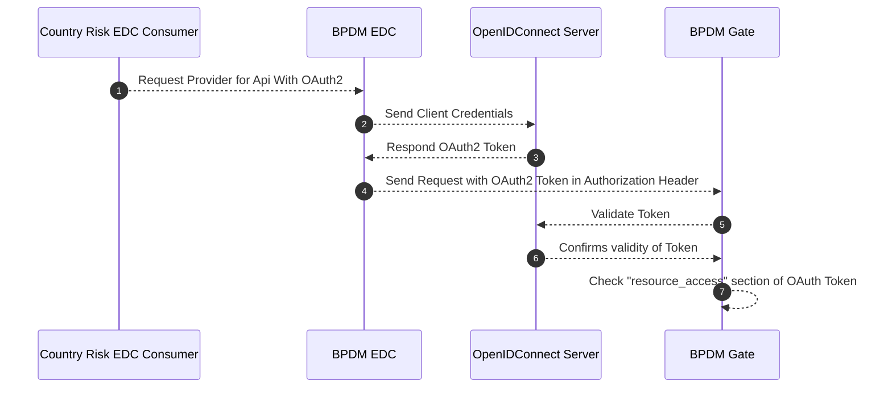

### Handling Country Risk

The handling of country risk within our system is managed by the Country Risk Application. 

It involves assessing and consuming data from the Country Risk EDC Consumer, which obtains necessary data from the EDC Gate Provider. 

This process ensures that the data related to country risk is accurate and up-to-date. The Country Risk Application doesn't filter the data; instead, it relies on the Gate service to validate user permissions and deliver the correct set of data based on the user's role and access rights.

### Data EDC Handling 

The security of data and ensuring that companies only access the data they are permitted to see is achieved through a robust authentication and authorization flow provided by Keycloak. 

When a company requests data, the Gate service validates the OAuth2 token provided in the request. 

This token contains the roles and permissions associated with the client user. By checking the "resource_access" section of the OAuth2 token, the Gate service ensures that a company can only access data for which it has the correct credentials. 

Additionally, the EDC Discovery Service can be employed to manage service endpoints and their associated access policies, enhancing the control over which data each company can discover and access.


## Business Context


### Technical Context


Topic     | Technologie
--------- | -------  
Backend           | Rest API, Java, KeyCloak
Front-End         | Typescript, ReactJS, React-Simple-Maps
Infrastructure    | Postgres Database, Azure, Github, ArgoCD, SonarCloud, VeraCode
UI/UX             | HTML, JavaScript, CSS


# Solution Strategy

# Building Block View

## White-box Overall System

This components Diagram represents the possible actions to be done by the user when opening the dashboard.

Each box represents a feature and each arrow between features represents its dependencies, as is the case of the world map that needs a rating selected to be filled in with the available colors.

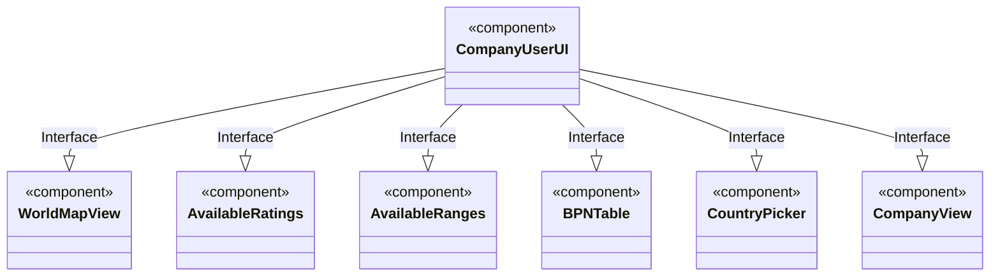

#### World Map View


For this component, it is necessary to call three different APIs that allow mapping the Map and painting based on the score obtained from each country.

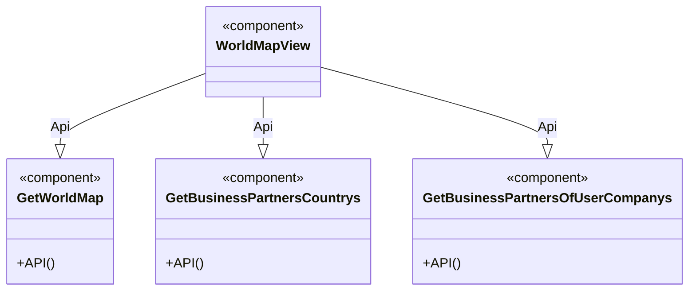

For each of these APIs we can consult its input and output in the APIs section.
##### Sample result


#### Ratings


For this component, it is necessary to call just one API that gets the Ratings available for the user.

Some Ratings may be available globally by user or by the company they belong to but for more details we will address in the functionalities section.

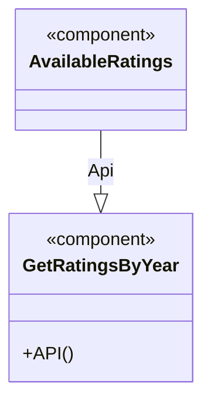

#### Ranges


For this component we have a call to two APIs, one that allows searching for a user's ranges, if any, and another that allows saving them if the user wants to for the next validation of the Map.

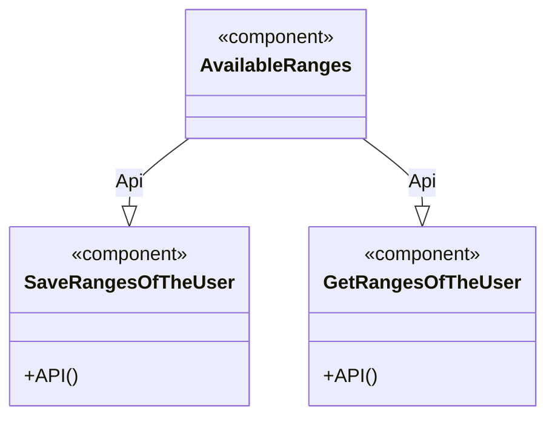

#### Business Partners Table


For this component, it is necessary to call just one API that gets the information about the Business Partners and the scores on which country they are displayed.

It is necessary for the user to select one or more ratings for this table to be fully initialized, more details in the functionalities section.

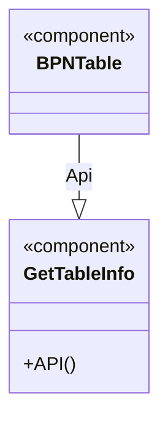

##### Sample Result


#### Country Picker


In this component, we call one API to populate the dropdown menu with a selection of countries. The API used is the getBpnCountries and as explained in the APIs and Swagger section, it retrieves all the countries that are associated to the Business partners.

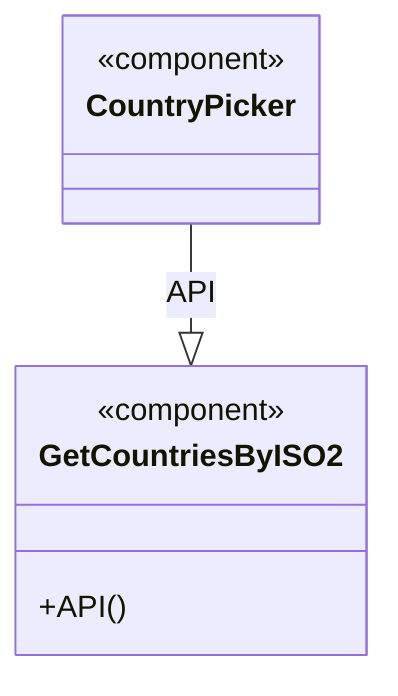

#### Company View


For this component, it is necessary to call three different APIs. The APIs used are the getBpnCountries, getCountryFilterByISO2 and getTableInfo.  With the data that we get from this APIs, and also with the value from the selected country in the country picker component, we can present on the map the markers for the Business Partners of the selected country with some information associated to the markers.

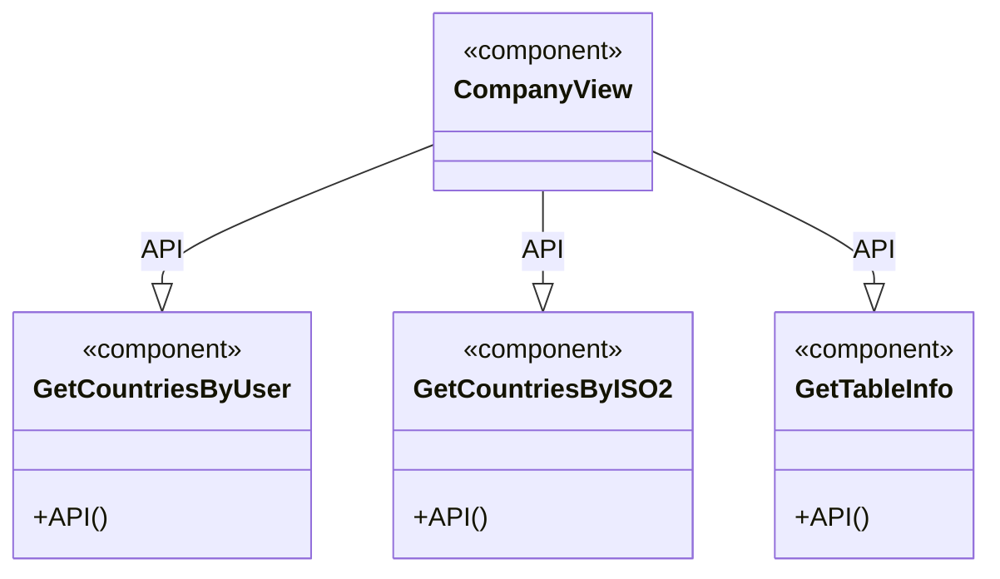

# Interfaces

Please Check Swagger Documentation
https://${hostname}:${port}/swagger-ui/index.html#/


### Endpoint explanation:

## Dashboard Controller


This endpoint is used to update the report. An example in the dashboard is when a user updates a report such as changing the selected rating ranges to change the rating colour ranges, the user can press the save reports button and the new settings will be updated.


This endpoint automatically inserts the information from the current user. The uploaded file needs to be in the format of the template which may be downloaded, with the file name being manually set. After upload, the data in the file is available to be utilised by the user in the application. Required parameters are rating name, rating year, and type (Global, Company or Custom).

Example:


This endpoint is used to share the ratings report. 
When a user has already saved their report and would like to share it, the user can share the report with other users from their company who have the required permissions to the Country Risk Dashboard.


In this endpoint, it is automatically inserted the information from the user that is accessing the tool, and it is manually inputted the three ranges currently selected by the user in the ranges component. These values are all saved using an object type. Example:


This endpoint is used to save an reports. It is used in the report component to save multiple selected data (Selected Ratings, Country, Range Values) and be able to use it in a later time. This endpoint receives as input field the Report name, the Type (Global, Company or Custom) of which the report should be saved for. Also it receives the current user information and an object that gathers all the selected data (Selected Ratings, Country, Range Values). Example:


In this endpoint it is retrieved all the ratings for a selected year. For example, if we input the year 2021 it is retrieved the following data.


This endpoint retrieves a score based on selected ratings, year and current user. See example bellow.


This endpoint is used for retrieving an the current user ranges. The values retrieved are the three types of ranges (Minimum, middle and Maximum), each associated to a type of value. This values are used to populate the ranges component with the last saved ranges that the user inputted.


This endpoint allows the retrieval of users from the user's company. 
The company is automatically extracted from the authentication token, thus avoiding filters. 
It is used when a report is to be shared for example.


This endpoint is used for retrieving an CSV file that the user can edit and use it for uploading data.


This endpoint retrieves Business partners based on selected ratings, user and selected year.


This endpoint is used to retrieve reports. This endpoint receives as input field an Report object and retrieves only a report relative to that information.


This endpoint is used to retrieve reports. It is used in the report component to to populate the table. This endpoint only receives as input field the current user information.


This endpoint is used to retrieve all the Reports that a user can choose from.


This endpoint retrieves all the Countries ordered by their ISO2 code.


This endpoint retrieves all the Business partners associated to a company.


This endpoint retrieves all the countries that are associated to the Business partners.


This endpoint returns information from the BPDM Gate to show the User specific Business Partners


This endpoint retrieves all the years that are currently saved on the database. This years are used to populate the year selection dropdown in the tool.


This endpoint is used to delete an report created by the user. It is used in the report table in the Front-End application. It needs the id related to the report selected and also the user information to proceed with the delete request.


This endpoint is used to delete an rating created by the user. It is used in the report table in the Front-End application. It needs the id related to the rating selected and also the user information to proceed with the delete request.

## Sharing Controller


In this endpoint the User can request a Mapping of Business Partners to a specific Rating. As parameters it is needed an Rating and BPNs array and also the company of he user.


In this picture, we can see how both the Ratings and BPNs are composed. The Ratings array can contain multiple objects that have the dataSourceName and the

following year. Regarding the BPNs array, it can also contain multiple objects, and each of them have the BPN name and a country of which can be given a value

or no value. If the BPN has no country value, the backend will map it according to the BPN.


In this endpoint it is possible for the user to request Information about which Ratings are available to his Company. The information needed is solely the Company and the Year.


## How to configure the Gate Connection

### Setting up Company Cluster

The first step to connect the Dashboard to a company specific "Gate" is setting up a Company Group.


we create a company group for the Case that a sharing Company has multiple "Gates" to which can be connected.


### Setting up Company
To be able to connect to a company specific Gate first the Company has to be inserted into the t_company table and connected to a company group:


- company_name: Insert the Name of the requesting Company
- company_group_id: Set a numeric value counting up from the beginning 1 per company


After the company has been added to the Table the next step is to set a "Gate" for this company.


### Setting up CompanyGate connection

To set the "Gate" Link the Administrator has to insert the following Information into the table t_company_group_gates


- gate_name: can be given freely preferably connected to name of the company
- company_gate_value: Direct Link to "Gate" developed by the BPDM Team
- company_group_id: Id of the company group created in the previous step


# Architecture Decisions

For all the planned use cases, a database was defined where we tried to optimize the relationships and the reuse of dynamic tables to the maximum to avoid extensive links and fields.

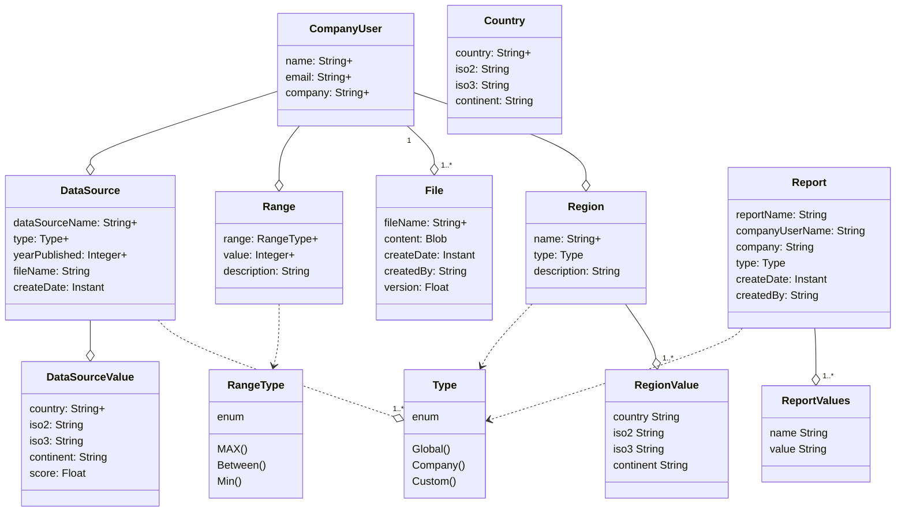

Entities:

1. CompanyUser: Table that represents the user that will allow us to identify, based on the information coming from the keycloak, which company the user belongs to for other filters.
2. DataSource and DataSourceValue: Dynamic tables that allow saving the source such as CPI Rating and its values ​​for each country such as GERMANY , DE , 86.
3. Range: Table that keeps the ranges submitted by each user, so that each visit to the page can visualize the data with the ranges that he customized. There are 3 ranges green, yellow and red which are identified by max, between and min.
4. File: Table that stores the template that the user can obtain and then stores any uploads that the user makes regarding their rating.
5. Country: Table that saves all the countries. This table is important to distinguish any bad input that the user can put, because only the countries placed here can be validated with rating.
6. Region: Table that stores each region defined by the user, this can be customized or globalized as is the case of having the countries of the European Union within the EU Region.
7. Report and ReportValue: Dynamic Table that, like the DataSource, allows each Report to have multiple objects added to it, in this case we can define the selected country, the ranges, the ratings and if new features are implemented, they can be added to new reports without the need to change.
8. Type: Enums table that allows you to filter the 3 tables ( DataSource , Region and Reports) that may or may not have globally available data, only for the elements of the Company or for the User who uploaded them.


# Development Process

We have two repositories in the TractusX Github Environment with the Eclipse Foundation.
Frontend: https://github.com/eclipse-tractusx/vas-country-risk-frontend
Backend: https://github.com/eclipse-tractusx/vas-country-risk-backend

To maintain those 2 Github locations we mainly develop in the CatenaX-ng Github. Only for main Changes we push a request to a commiter with the Eclipse Foundation Github.

To contribute to the development please follow these Branching guidelines in the CatenaX-ng environment.

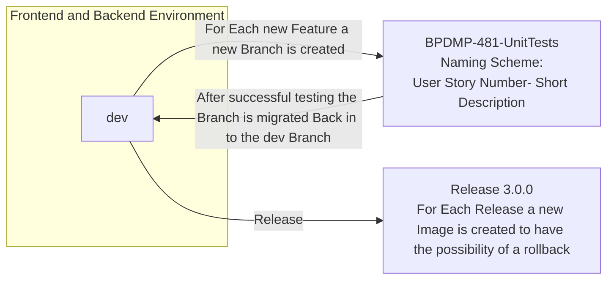

# Sequence Diagram

#### Endpoint: /dashboard/getTableInfo

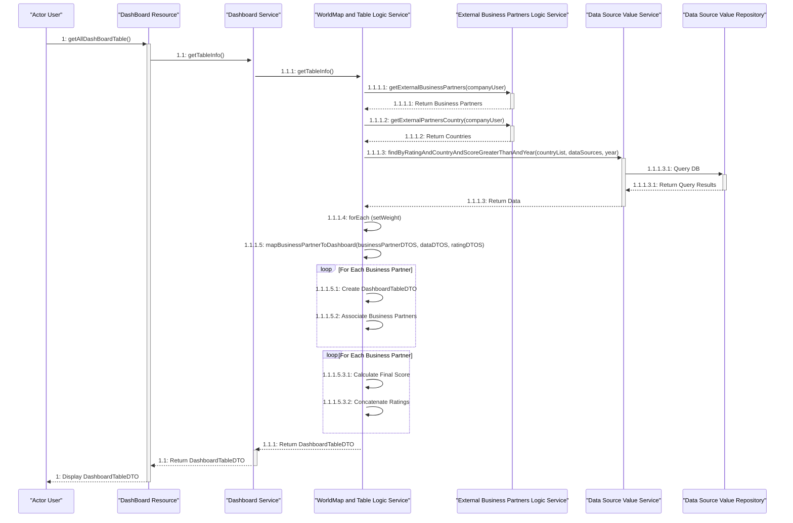

In the DashBoardResource we invoke the method getTableInfo, that is inside the DashboardService.

In there we invoke the method getTableInfo, which is situated in the WorldMapAndTableLogicService. Inside this method is were most of the logic is located.

In 1.1.1.1, we invoke the method getExternalBusinessPartners from the ExternalBusinessPartnersLogicService, in which we pass the object companyUser. In this method we return Business Partners associated to a company user.

In 1.1.1.2, we invoke the method getExternalPartnersCountry from the ExternalBusinessPartnersLogicService, in which we pass the object companyUser. In this method we return the Countries from Business Partners associated to a Company User.

In 1.1.1.3, we invoke the method findByRatingAndCountryAndScoreGreaterThanAndYear from the DataSourceValueService. In this method we pass countryList (List of countries from Business Partners associated to a company user), dataSources (List of datasources names) and the year (Integer). After this we call a similar method (1.1.1.3.1), but this time it is inside the DataSourceValueRepository. In the repository is were the data from the Database is retrieved using Query's in this case.

In 1.1.1.4 and 1.1.1.4.1 there is a forEach logic, where the setter setWeight method is invoked to populate this variable in the recently returned ArrayList of DataDTO from the 1.1.1.3 methods.

After this, in the 1.1.1.5, we invoke the method mapBusinessPartnerToDashboard, in which businessPartnerDTOS, dataDTOS and ratingDTO List are passed. Inside the method a new DashboardTableDTO object is created and business partners are associated to that object (1.1.1.5.2, 1.1.1.5.2.1).

After that, in the 1.1.1.5.3 method, inside a for iteration, firstly it filters the countries which the business partners are associated. After that, in 1.1.1.5.3.3.1 method it is calculated the score for each country, using the weight value that comes as a parameters from the number of selected ratings in the dashboard.


#### Endpoint: /dashboard/getWorldMap

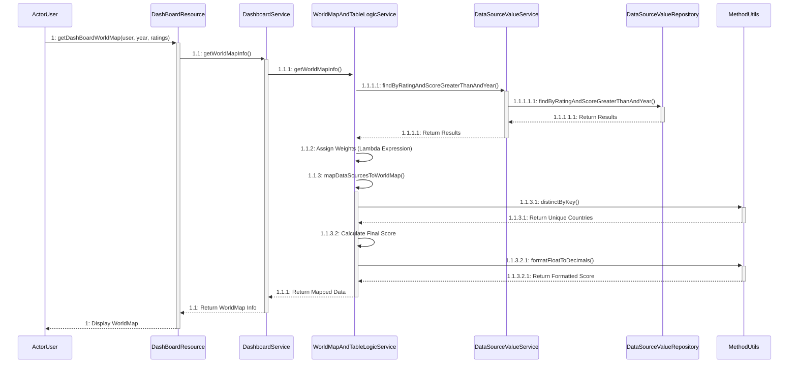

This Get Dashboard World endpoint is the entry point for populating the World Map.

It receives parameters that allow knowing which data to filter.
These are: The user, the year and the Ratings chosen.

The first important method Get World Map Info is divided into three steps.

    FindByRatingAndScoreGreaterThanAndYear method that, depending on the values
    entered, will find all available Ratings for this user to choose later in the UI.
    1.1.2:() =>  it is not a method but a lambda expression that will assign the weights introduced by the user to the corresponding ratings.
    Map Data Source To World Map is a method that maps the scores of each country in two important steps.
        Distinct By Key each rating has multiple countries and we need to filter the list of single countries so this method returns a single list of countries based on the chosen ratings.
        Calculate Final Score Based on the weight chosen by the user, the formula is applied to each rating to reference each score in each country present.

Examples of the calculation done to get the score for each country:

Formula: Score = ( rating1Score * weight1 ) + (rating2Score * weight2 )

Score: Country → Germany , Score = ( 36 from CPI Rating * 0.4 % ) +  50 from Basel * 0.6% )


#### Endpoint: /dashboard/allYears

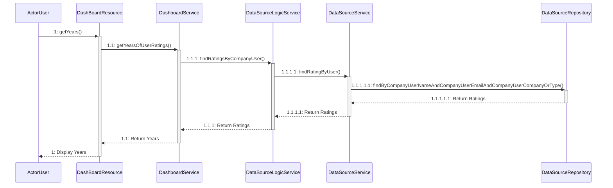

This endpoint returns all possible years based on the ratings this user can view.
So in the UI we have a bar with the years in which, when changing, the user can see the various ratings for each selected year.

We have only one important method which is the findRatingsByCompanyUser which based on the user who is consulting the year will be filtered and returned.


#### Endpoint: /dashboard/ratingsByYear

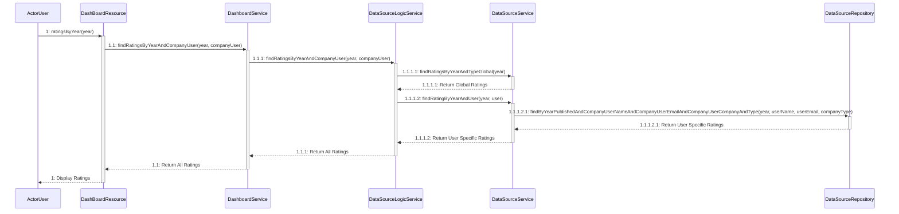

This endpoint, as mentioned above, receives the selected year and returns the available ratings for this user based on the year.

Here we have an important step that calls two methods.

On findRatingsByYearAndCompanyUser we need to call two methods, findRatingsByYearAndTypeGlobal which returns all global ratings that are for all users based on year and findRatingByYearAndUser all ratings that this user has available to him filtered by year here can be uniquely loaded by you in the api of Upload.


#### Endpoint: /dashboard/getTemplate

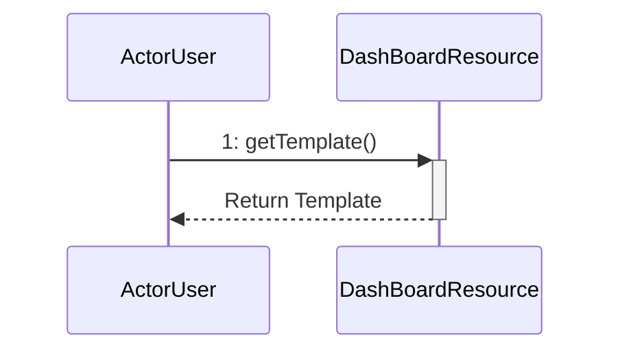

This method just implements the download of a template so that users can fill and upload their own ratings.


#### Endpoint: /dashboard/uploadCsv

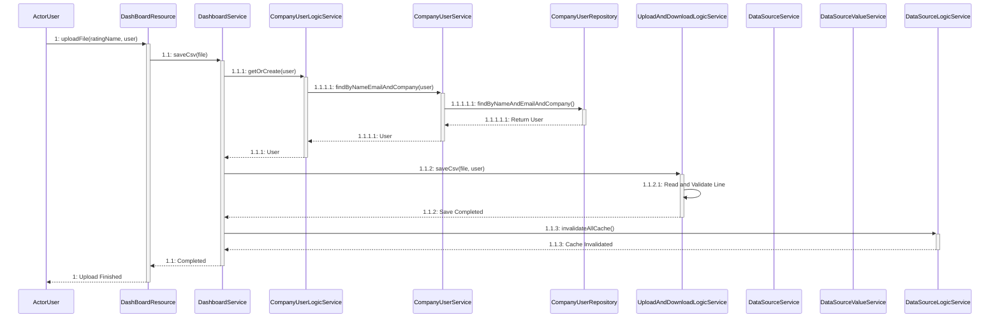

This method is used to upload new ratings, it receives the name of the rating and the user who uploaded it as a parameter.

The save Csv method consists of two steps, getOrCreate and 1.1.2 saveCSV.

Get or Create is based on searching if this user already exists and if it does not exist, it creates a new one with its data.

1.1.2 Save Csv reads each line of the file, divides and validates if all the necessary parameters are present to be able to save each score corresponding to each country.

Each line must contain the Continent of the Country, the name that may vary depending on the language, the isocode 2 and isocode 3, the score may not be mandatory and is by default at -1 if it is not present.


#### Endpoint: /dashboard/getUserRanges

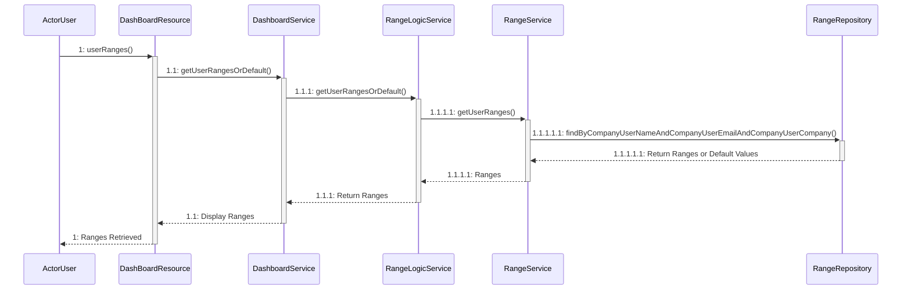

This endpoint is simple, it only validates if the user already has saved ranges or uses default values, these ranges are used to define the range of each color in the UI, which then defines how each country will be painted based on its score.

Get User Ranges Or Default is the method that validates if they exist if not, by default, it returns their default values.

Min → 0-25 that represents red color

Between → 26-50 that represents yellow color

Max → 51-100 that represents red color


#### Endpoint: /dashboard/getCountryFilterByISO2

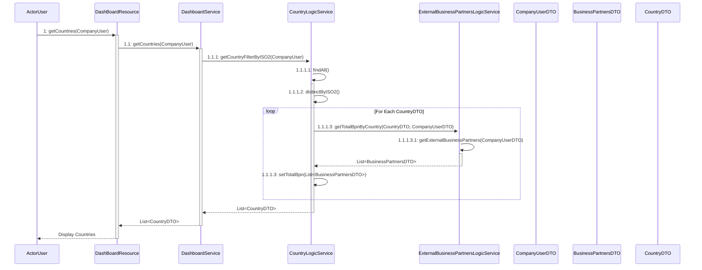

This endpoint retrieves all the Countries ordered by their ISO2 code. As a parameter it receives an CompanyUser object.

This information flows through various methods (1, 1.1) until it reaches the method getCountryFilterByISO2 (1.1.1) in the class CountryLogicService where most of the operations are located.

In this method, firstly it is invoked the findAll method (1.1.1.1) which gets all the countrys with an distinct ISO2 code (1.1.1.2) and this data is stored in the List of CountryDTO. After that the List is iterated using a forEach Statment (1.1.1.3), and inside of it it is invoked the getTotalBpnByCountry (1.1.1.3.1) from the ExternalBussinessPartnersLogicService class.

The method getTotalBpnByCountry (1.1.1.3.1) receives as parameters an CountryDTO from the iteration of the List of CountryDTO that was returned on the method (1.1.1.1) and an CompanyUserDTO. Inside of the method it is invoked the getExternalBusinessPartners (1.1.1.3.1.1) which returns Business Partners associated to a Company User and this data is stored inside an List of BusinessPartnersDTO, which will then be used to filter the number of Business Partners present in the countries retrieved earlier in the 1.1.1.1 method.

After that a value (Long) is returned consequently until the last List element is reached and using an setter method (setTotalBpn) it is added an value to the totalBpn variable in the Object of Countries List.

After that, the List of CountryDTO's id returned all the way through to the DashBoardResource class that contains the getCountrys method.


#### Endpoint: /dashboard/getCompanyBpns

```mermaid
sequenceDiagram
    participant ActorUser 
    participant DashBoardResource 
    participant DashboardService 
    participant ExternalBusinessPartnersLogicService

    ActorUser->>+DashBoardResource: 1: getCompanyBpns()
    DashBoardResource->>+DashboardService: 1.1: getExternalBusinessPartners()
    DashboardService->>+ExternalBusinessPartnersLogicService: 1.1.1: getExternalBusinessPartners()
    ExternalBusinessPartnersLogicService-->>-DashboardService: 1.1.1: Return Business Partners
    DashboardService-->>-DashBoardResource: 1.1: Return Business Partners
    DashBoardResource-->>-ActorUser: 1: Display Business Partners
```

This endpoint retrieves all the Business partners associated to a company. In the DashboardResource we invoke the getExternalBusinessPartners method, in which we send through an CompanyUser (1.1).

Inside the DashboardService class we return the result from the method getExternalBusinessPartners (1.1.1) returns Business Partners associated to a Company User.

In the end, after the data is retrieved, this data is returned as a List of BussinessPartners objects to the main class DashBoardResource in the method getCompanyBpns.


#### Endpoint: /dashboard/getBpnCountrys

```mermaid
sequenceDiagram
    participant ActorUser 
    participant DashBoardResource 
    participant DashboardService 
    participant CountryLogicService 
    participant ExternalBusinessPartnersLogicService 
    participant CountryService 
    participant CountryRepository 
    participant EntityMapper 

    ActorUser->>+DashBoardResource: 1: getBpnCountries()
    DashBoardResource->>+DashboardService: 1.1: getCountryByAssociatedBPtoUser(CompanyUser)
    DashboardService->>+CountryLogicService: 1.1.1: getAssociatedCountries(CompanyUser)
    
    CountryLogicService->>+ExternalBusinessPartnersLogicService: 1.1.1.1: getExternalPartnersCountry(CompanyUser)
    ExternalBusinessPartnersLogicService-->>-CountryLogicService: 1.1.1.1: Return List<String> of Countries
    
    CountryLogicService->>+CountryService: 1.1.1.2: findByCountryIn(List<String>)
    CountryService->>+CountryRepository: 1.1.1.2.1: findByCountryIn(List<String>)
    CountryRepository-->>-CountryService: 1.1.1.2.1: Return List<Country>
    CountryService->>+EntityMapper: 1.1.1.2.2: toDto(List<Country>)
    EntityMapper-->>-CountryService: 1.1.1.2.2: Return List<CountryDTO>
    
    CountryService-->>-CountryLogicService: 1.1.1.2: Return List<CountryDTO>
    CountryLogicService-->>-DashboardService: 1.1.1: Return List<CountryDTO>
    DashboardService-->>-DashBoardResource: 1.1: Return List<CountryDTO>
    DashBoardResource-->>-ActorUser: 1: Display Countries

```

This endpoint retrieves all the countries that are associated to the Business partners.  In the DashboardResource we invoke the getCountryByAssociatedBPtoUser (1.1) method, in which we send through an CompanyUser.

In the DashboardService class, we invoke the method getAssociatedCountries (1.1.1), in which there are two methods: getExternalPartnersCountry (1.1.1.1) and the findByCountryIn (1.1.1.2).

The method getExternalPartnersCountry (1.1.1.1) it is returned the Countries from Business Partners associated to a Company User and store the result in a List of Strings.

The method findByCountryIn (1.1.1.2) we pass the returned List of String of the method (1.1.1.1) and it is returned the full information of an country which is present on that same List of Strings. This information is then stored in a List of CountryDTO, which then is returned to the class DashBoardResource to the method getBpnCountrys (1).


#### Endpoint: /dashboard/saveUserRanges

```mermaid
sequenceDiagram
    participant ActorUser 
    participant DashBoardResource 
    participant DashboardService 
    participant CompanyUserLogicService 
    participant CompanyUserService 
    participant CompanyUserRepository 
    participant RangeLogicService 
    participant RangeService 
    participant RangeRepository 
    participant RangeMapper 
    participant ResponseMessage 

    ActorUser->>+DashBoardResource: 1: saveRanges(List<RangeDTO>, CompanyUser)
    DashBoardResource->>+DashboardService: 1.1: saveRanges(List<RangeDTO>, CompanyUser)
    DashboardService->>+CompanyUserLogicService: 1.1.1: getOrCreate(CompanyUser)
    CompanyUserLogicService->>+CompanyUserService: 1.1.1.1: findByNameEmailAndCompany(CompanyUser)
    CompanyUserService->>+CompanyUserRepository: 1.1.1.1.1: findByNameEmailAndCompany(CompanyUser)
    CompanyUserRepository-->>-CompanyUserService: 1.1.1.1.1: Return CompanyUser
    CompanyUserService-->>-CompanyUserLogicService: 1.1.1.1: Return CompanyUser
    CompanyUserLogicService-->>-DashboardService: 1.1.1: Return CompanyUser
    DashboardService->>+RangeLogicService: 1.1.2: saveRanges(List<RangeDTO>, CompanyUser)
    RangeLogicService->>+RangeService: 1.1.2.1: getUserRanges(CompanyUser)
    RangeService->>+RangeRepository: 1.1.2.1.1: findByCompanyUser(CompanyUser)
    RangeRepository-->>-RangeService: 1.1.2.1.1: Return List<Range>
    RangeService-->>-RangeLogicService: 1.1.2.1: Return List<Range>
    RangeLogicService->>RangeLogicService: 1.1.2.2: Check and Save Ranges
    RangeLogicService->>+RangeMapper: 1.1.2.2.1: toDto(Range)
    RangeMapper-->>-RangeLogicService: 1.1.2.2.1: Return RangeDTO
    RangeLogicService->>RangeLogicService: 1.1.2.3: Update Ranges
    RangeLogicService->>+RangeService: 1.1.2.3.1: setValueForRange(RangeDTO)
    RangeService-->>-RangeLogicService: 1.1.2.3.1: Updated RangeDTO
    RangeLogicService-->>-DashboardService: 1.1.2: Return List<RangeDTO>
    DashboardService->>ResponseMessage: 1.2: createResponse(List<RangeDTO>)
    DashboardService-->>-DashBoardResource: 1.1: Return ResponseMessage
    DashBoardResource-->>-ActorUser: 1: Display ResponseMessage

```

In this endpoint, it is received as a parameter a List of RangeDTO that contain three different values affect to three different "Types" (Max, Between and Min) and a CompanyUser.

The method 1.1.1 getOrCreate does the following: if the presented company user does not have an row stored in the database, it creates it with the current information, otherwise it gets the current data on the row with the same data and returns it to the saveRanges (1.1) method.

After that, in the 1.1.2 saveRanges method, that is inside the RangeLogicService class, it is passed as a parameter the returned CompanyUser and the RangesDTO.

Inside this method (1.1.2), firstly it is invoked the method 1.1.2.1 getUserRanges which returns a List of RangeDTO related to the company user if this exists on the database.

In 1.1.2.2 an iteration is made if the returned List is empty. In this iteration it is created an rangeDTO for the related company user and saved in 1.1.2.2.1.

If the range already exists, in 1.1.2.3 an ForEach iteration is made where the RangeDTO objects from the returned List in 1.1.2 are updated (1.1.2.3.1) according the new values received as a parameter in the saveRanges method (1).


#### Endpoint: /dashboard/getReportsByCompanyUser

```mermaid
sequenceDiagram
    participant ActorUser 
    participant DashBoardResource 
    participant DashboardService 
    participant ReportLogicService 
    participant ReportService 
    participant ReportRepository 
    participant EntityMapper 

    ActorUser->>+DashBoardResource: 1: getReportsByCompanyUser(CompanyUser)
    DashBoardResource->>+DashboardService: 1.1: getReportsByCompanyUser(CompanyUser)
    DashboardService->>+ReportLogicService: 1.1.1: getCompanyReports(CompanyUser.companyName, 'Company')
    ReportLogicService->>+ReportService: 1.1.1.1: findByCompanyAndType(CompanyUser.companyName, 'Company')
    ReportService->>+ReportRepository: 1.1.1.1.1: findByCompanyAndType(CompanyUser.companyName, 'Company')
    ReportRepository-->>-ReportService: 1.1.1.1.1: Return Reports
    ReportService->>+EntityMapper: 1.1.1.1.2: toDto(List<Report>)
    EntityMapper-->>-ReportService: 1.1.1.1.2: Return List<ReportDTO>
    ReportService-->>-ReportLogicService: 1.1.1.1: Return List<ReportDTO>

    DashboardService->>+ReportLogicService: 1.1.2: getReportsForCompanyUser(CompanyUser.name, CompanyUser.companyName, 'Custom')
    ReportLogicService->>+ReportService: 1.1.2.1: findByCompanyUserNameAndCompanyAndType(CompanyUser.name, CompanyUser.companyName, 'Custom')
    ReportService->>+ReportRepository: 1.1.2.1.1: findByCompanyUserNameAndCompanyAndType(CompanyUser.name, CompanyUser.companyName, 'Custom')
    ReportRepository-->>-ReportService: 1.1.2.1.1: Return Reports
    ReportService->>+EntityMapper: 1.1.2.1.2: toDto(List<Report>)
    EntityMapper-->>-ReportService: 1.1.2.1.2: Return List<ReportDTO>
    ReportService-->>-ReportLogicService: 1.1.2.1: Return List<ReportDTO>

    ReportLogicService->>ReportLogicService: Combine List<ReportDTO>
    ReportLogicService-->>-DashboardService: 1.1: Return Combined List<ReportDTO>
    DashboardService-->>-DashBoardResource: 1.1: Return Combined List<ReportDTO>
    DashBoardResource-->>-ActorUser: 1: Display Reports
```

In this endpoint, it is received as a parameter only the CompanyUser. It is used to return an list of ReportDTO related to the CompanyUser parameter received.

The method 1.1 that is inside the dashboardService class, two methods are used to retrieve report information. The methods are the 1.1.1 getCompanyReports and 1.1.2 getReportsForCompanyUser

The 1.1.1 method is going to retrieve a list of ReportDTO according the CompanyUser company name a Type Company.

The 1.1.2 method is going to retrieve a list of ReportDTO according the CompanyUser name, CompanyUser company name and Type Custom.

After that, this lists are joined into a biggest ReportDTO List, that then is returned to the main class method getReportsByCompanyUser.


#### Endpoint: /dashboard/saveReports

```mermaid
sequenceDiagram
    participant ActorUser 
    participant DashBoardResource 
    participant DashboardService 
    participant CompanyUserLogicService 
    participant CompanyUserService 
    participant ReportLogicService 
    participant ReportService 
    participant ResponseMessage 

    ActorUser->>+DashBoardResource: 1: saveReport(CompanyUser, ReportDTO)
    DashBoardResource->>+DashboardService: 1.1: saveReport(CompanyUser, ReportDTO)
    DashboardService->>+CompanyUserLogicService: 1.1.1: getOrCreate(CompanyUser)
    CompanyUserLogicService->>+CompanyUserService: 1.1.1.1: findByNameEmailAndCompany(CompanyUser)
    CompanyUserService-->>-CompanyUserLogicService: User found or created
    CompanyUserLogicService-->>-DashboardService: CompanyUserDTO
    DashboardService->>+ReportLogicService: 1.1.2: saveReport(CompanyUserDTO, ReportDTO)
    
    ReportLogicService->>+ReportService: 1.1.2.1: Check and process ReportDTO
    ReportService-->>-ReportLogicService: Report processed

    ReportLogicService-->>-DashboardService: Return result
    DashboardService->>+ResponseMessage: 1.2: createResponse()
    ResponseMessage-->>-DashboardService: ResponseMessage created
    DashboardService-->>-DashBoardResource: ResponseMessage
    DashBoardResource-->>-ActorUser: Display Response

```

In this endpoint, it is received as a parameter the CompanyUser and an ReportDTO that will be saved. It is used to save an ReportDTO related to the CompanyUser parameter received.

The method 1.1.1 getOrCreate will receive the parameter CompanyUser, and will do a verification if that user is already created. If not it will create that user.

After that, on the 1.1.2 saveReport, both the companyUserDTO recently created or already present on the database and the ReportDTO will be used as variable on that method.

Firstly an verification is done to check if the ReportDTO has an id associated to him. This will only be he case in the Update endpoint, so this verification will not be true. After this, it is associated to the ReportDTO the companyUserDTO company name and name, and after this the ReportDTO is saved (1.1.2.1.6.1).

After this an verification is done onto the recently saved ReportDTO, to check if the ReportValuesDTO inside of this object is not empty or null. If this is false, an for each clause will occur and save each reportValues associated to the recently created Report.

After this an Http OK alert is shown.

If the report would been duplicated, an Http Bad Request status would be shown, and the same if some failure would occur on the process.


#### Endpoint: /dashboard/shareReports

```mermaid
sequenceDiagram
    participant ActorUser 
    participant DashBoardResource 
    participant DashboardService 
    participant CompanyUserService 
    participant CompanyUserRepository 
    participant ReportLogicService 
    participant ReportService
    participant ReportRepository 
    participant EntityMapper 
    participant ResponseMessage 

    ActorUser->>+DashBoardResource: 1: shareReport(CompanyUser, ReportDTO)
    DashBoardResource->>+DashboardService: 1.1: shareReport(CompanyUser, ReportDTO)
    DashboardService->>+CompanyUserService: 1.1.1: findByNameEmailAndCompany(ReportDTO.name, ReportDTO.email, ReportDTO.company)
    CompanyUserService->>+CompanyUserRepository: 1.1.1.1: findByNameEmailAndCompany(ReportDTO)
    alt User exists
        CompanyUserRepository-->>-CompanyUserService: CompanyUserDTO
        CompanyUserService-->>-DashboardService: CompanyUserDTO
        DashboardService->>+ReportLogicService: 1.1.2: saveReport(CompanyUserDTO, ReportDTO)
        ReportLogicService->>+ReportService: 1.1.2.1: Check Report ID and Save
        alt Report ID does not exist
            ReportService->>ReportRepository: 1.1.2.1.6: save(ReportDTO)
            ReportRepository-->>ReportService: Report saved
            ReportService->>ReportService: 1.1.2.1.6.1: Check and Save ReportValues
            loop Each ReportValue
                ReportService->>ReportService: 1.1.2.1.6.1.x: save(ReportValue)
            end
            ReportService-->>-ReportLogicService: ReportValues saved
        else Report ID exists
            ReportLogicService->>ResponseMessage: 1.1.2.2: Http Bad Request (Duplicated)
        end
        ReportLogicService-->>-DashboardService: Process Completed
    else User does not exist
        CompanyUserRepository-->>ResponseMessage: 1.1.1.2: Http Not Found
    end
    DashboardService-->>-DashBoardResource: Response
    DashBoardResource-->>-ActorUser: Display Response

```

In this endpoint, it is received as a parameter the CompanyUser and an ReportDTO that will be used to be shared. It is used to share an ReportDTO related to the CompanyUser parameter received.

The method 1.1.1 findByNameEmailAndCompany will receive the name, email and company from the ReportDTO, and will do a verification if that user exists. If not it will show an Http status not found.

After that, on the 1.1.2 saveReport, both the companyUserDTO recently created or already present on the database and the ReportDTO will be used as variable on that method.

Firstly an verification is done to check if the ReportDTO has an id associated to him. This will only be he case in the Update endpoint, so this verification will not be true. After this, it is associated to the ReportDTO the companyUserDTO company name and name, and after this the ReportDTO is saved (1.1.2.1.6.1).

After this an verification is done onto the recently saved ReportDTO, to check if the ReportValuesDTO inside of this object is not empty or null. If this is false, an for each clause will occur and save each reportValues associated to the recently created Report.

After this an Http OK alert is shown.

If the report would been duplicated, an Http Bad Request status would be shown, and the same if some failure would occur on the process.


#### Endpoint: /dashboard/updateReports

```mermaid
sequenceDiagram
    participant ActorUser 
    participant DashBoardResource 
    participant DashboardService 
    participant CompanyUserLogicService 
    participant ReportLogicService 
    participant ReportService 
    participant ReportRepository 
    participant ReportValueService 
    participant ResponseMessage

    ActorUser->>DashBoardResource: 1: updateReport(CompanyUser, ReportDTO)
    DashBoardResource->>DashboardService: 1.1: updateReport(CompanyUser, ReportDTO)
    DashboardService->>CompanyUserLogicService: 1.1.1: getOrCreate(CompanyUser)
    CompanyUserLogicService-->>DashboardService: CompanyUserDTO
    DashboardService->>ReportLogicService: 1.1.2: saveReport(CompanyUserDTO, ReportDTO)

    alt If ReportDTO has ID
        ReportLogicService->>ReportService: 1.1.2.1: Update Report
        ReportService->>ReportRepository: 1.1.2.1.1: findOne(ReportDTO.id)
        alt If Report not found
            ReportRepository-->>ReportService: Not Found
            ReportService-->>ReportLogicService: Http Not Found
        else Report found
            ReportRepository-->>ReportService: Found Report
            ReportService->>ReportService: 1.1.2.1.3: validatePermissionToChangeReport(CompanyUserDTO, ReportDTO)
            alt If validation fails
                ReportService-->>ReportLogicService: Http Unauthorized
            else Validation succeeds
                ReportService-->>ReportLogicService: Permission Granted
                ReportLogicService->>ReportValueService: 1.1.2.1.4: Update Report Values
                ReportValueService-->>ReportLogicService: Report Values Updated
            end
        end
        ReportLogicService-->>DashboardService: Report Processing Complete
    else No ID present
        ReportLogicService->>ReportService: Create New Report
        ReportService-->>ReportLogicService: New Report Created
    end

    DashboardService->>ResponseMessage: 1.2: createResponse()
    ResponseMessage-->>DashboardService: Response Created
    DashboardService-->>DashBoardResource: ResponseMessage
    DashBoardResource-->>ActorUser: Display Response

```

In this endpoint, it is received as a parameter the CompanyUser and an ReportDTO that will be used to be updated. It is used to update an ReportDTO related to the CompanyUser parameter received.

The method 1.1.1 getOrCreate will receive the parameter CompanyUser, and will do a verification if that user is already created. If not it will create that user.

After that, on the 1.1.2 saveReport, both the companyUserDTO recently created or already present on the database and the ReportDTO will be used as variable on that method.

Firstly an verification is done to check if the ReportDTO has an id associated to him. This will only be he case in the Update endpoint, so this verification will true in this case. After this, the updateReport method (1.1.2.1) will be opened and in there the method 1.1.2.1.1 findOne will try to find an ReportDTO with respective id. If it is not found, an http not found error will show up.

Else if this does not occur, an validation is done with the method 1.1.2.1.3 validatePermissionToChangeReport, which will do an cross check between the CompanyUser and the found ReportDTO. If this check is false, an http unauthorized error is shown, else the code continues.

After the 1.1.2.1.3 verification, the respective ReportValues are found according to the ReportDTO, and each found values are firstly deleted and then saved with the new information.

After this an Http no content alert is shown, as a sign that the request has been fulfilled.


#### Endpoint: /dashboard/getReportsValueByReport

```mermaid
sequenceDiagram
    participant ActorUser 
    participant DashBoardResource 
    participant DashboardService 
    participant ReportLogicService 
    participant ReportValuesService 
    participant EntityMapper 
    participant ReportValuesRepository 

    ActorUser->>+DashBoardResource: 1: getReportsValueByReport(CompanyUser, ReportDTO)
    DashBoardResource->>+DashboardService: 1.1: getReportValues(ReportDTO)
    
    alt If ReportDTO is not null
        DashboardService->>+ReportLogicService: 1.1.1: getReportValues(ReportDTO)
        ReportLogicService->>+ReportValuesService: 1.1.1.1: findByReport(ReportDTO)
        ReportValuesService->>+ReportValuesRepository: 1.1.1.1.1: findByReport(ReportDTO)
        ReportValuesRepository-->>-ReportValuesService: List<ReportValue>
        ReportValuesService->>+EntityMapper: 1.1.1.1.1.1: toDto(List<ReportValue>)
        EntityMapper-->>-ReportValuesService: List<ReportValuesDTO>
        ReportValuesService-->>-ReportLogicService: List<ReportValuesDTO>
        ReportLogicService-->>-DashboardService: List<ReportValuesDTO>
        DashboardService-->>-DashBoardResource: List<ReportValuesDTO>
    else If ReportDTO is null
        DashboardService-->>DashBoardResource: Empty List<ReportValuesDTO>
    end

    DashBoardResource-->>-ActorUser: Display ReportValues

```

In this endpoint, it is received as a parameter the CompanyUser and an ReportDTO. It is used to return an list of ReportValuesDTO related to the CompanyUser and RepotDTO parameters received.

The method 1.1 that is inside the dashboardService class, the 1.1.1 getReportValues is used to firstly do a verification if the ReportDTO parameter is null, in which case an empty ArrayList is returned, otherwise the 1.1.1.1 findByReport method is done to retrieved the data (ReportValuesDTO) associated with the ReportDTO.

After this, an List of ReportValuesDTO is returned in the main class (DashBoardResource).


#### Endpoint: /dashboard/getAllUserBPDMGates

```mermaid
sequenceDiagram
    participant ActorUser 
    participant DashBoardResource 
    participant DashboardService 
    participant CompanyGatesLogicService 
    participant CompanyService 
    participant CompanyRepository 
    participant CompanyMapperImpl 
    participant CompanyDTO 
    participant CompanyGatesService 
    participant CompanyGatesRepository 
    participant EntityMapper 

    ActorUser->>+DashBoardResource: 1: getAllUserBPDMGates(CompanyUser)
    DashBoardResource->>+DashboardService: 1.1: getGatesForCompanyUser(CompanyUser)
    DashboardService->>+CompanyGatesLogicService: 1.1.1: getGatesForCompanyUser(CompanyUser)
    CompanyGatesLogicService->>+CompanyService: 1.1.1.1: getCompanyByCompanyName(CompanyUser.companyName)
    CompanyService->>+CompanyRepository: 1.1.1.1.1: findByCompanyName(CompanyUser.companyName)
    CompanyRepository-->>-CompanyService: Company
    CompanyService->>+CompanyMapperImpl: 1.1.1.1.1.2: toDto(Company)
    CompanyMapperImpl-->>-CompanyService: CompanyDTO
    CompanyService-->>-CompanyGatesLogicService: CompanyDTO
    CompanyGatesLogicService->>+CompanyGatesService: 1.1.1.2: findByCompanyGroup(CompanyDTO.groupId)
    CompanyGatesService->>+CompanyGatesRepository: 1.1.1.2.1: findByCompanyGroup(CompanyDTO.groupId)
    CompanyGatesRepository-->>-CompanyGatesService: List<CompanyGate>
    CompanyGatesService->>+EntityMapper: 1.1.1.2.2: toDto(List<CompanyGate>)
    EntityMapper-->>-CompanyGatesService: List<CompanyGatesDTO>
    CompanyGatesService-->>-CompanyGatesLogicService: List<CompanyGatesDTO>
    CompanyGatesLogicService-->>-DashboardService: List<CompanyGatesDTO>
    DashboardService-->>-DashBoardResource: List<CompanyGatesDTO>
    DashBoardResource-->>-ActorUser: Display CompanyGatesDTOs

```

In this endpoint, it is received as a parameter the CompanyUser. It is used to return an list of CompanyGatesDTO related to the CompanyUser.

The method 1.1.1 getGatesForCompanyUser, it firstly done the method getCompanyByCompanyName which should return an CompanyDTO in case this exists based on the CompanyUser Company. If this CompanyDTO is present, the 1.1.1.2 findByCompanyGroup method is called which will return a list of CompanyGatesDTO based on the recently returned CompanyDTO.

After this, an List of CompanyGatesDTOS is returned in the main class (DashBoardResouce).


#### Endpoint: /sharing/getAllRatingsForCompany

```mermaid
sequenceDiagram
    participant ActorUser 
    participant DashBoardResource 
    participant DashboardService 
    participant DataSourceLogicService 
    participant DataSourceService 
    participant DataSourceRepository 
    participant EntityMapper 

    ActorUser->>+DashBoardResource: 1: getAllRatingsForCompany(CompanyUser, Year)
    DashBoardResource->>+DashboardService: 1.1: findRatingsByYearAndCompanyUserCompany(CompanyUser, Year)
    DashboardService->>+DataSourceLogicService: 1.1.1: findRatingsByYearAndTypeGlobal(Year)
    DataSourceLogicService->>+DataSourceService: 1.1.1.1: findRatingsByYearPublishedAndType(Year, 'Global')
    DataSourceService->>+DataSourceRepository: 1.1.1.1.1: findByYearPublishedAndType(Year, 'Global')
    DataSourceRepository-->>-DataSourceService: List<DataSource>
    DataSourceService->>+EntityMapper: 1.1.1.1.2: toDto(List<DataSource>)
    EntityMapper-->>-DataSourceService: List<DataSourceDTO>
    DataSourceService-->>-DataSourceLogicService: List<DataSourceDTO>
    DataSourceLogicService->>+DataSourceService: 1.1.1.2: findByYearPublishedAndCompanyUserCompanyNameAndType(Year, CompanyUser.companyName, 'Company')
    DataSourceService->>+DataSourceRepository: 1.1.1.2.1: findByYearPublishedAndCompanyUserCompanyNameAndType(Year, CompanyUser.companyName, 'Company')
    DataSourceRepository-->>-DataSourceService: List<DataSource>
    DataSourceService->>+EntityMapper: 1.1.1.2.2: toDto(List<DataSource>)
    EntityMapper-->>-DataSourceService: List<DataSourceDTO>
    DataSourceService-->>-DataSourceLogicService: List<DataSourceDTO>
    DataSourceLogicService-->>-DashboardService: Combined List<DataSourceDTO>
    DashboardService-->>-DashBoardResource: Combined List<DataSourceDTO>
    DashBoardResource-->>-ActorUser: Display DataSources

```

In this endpoint, it is received as a parameter the CompanyUser and a Integer Year. It is used to return an list of DataSourceDTO related to the CompanyUser and inserted year.

The method 1.1.1.1 findRatingsByYearAndTypeGlobal will return a list of DataSourceDTO based on the selected year, and only return these DTOs with Type Global.

After that, the method 1.1.1.2 findByYearPublishedAndCompanyUserCompanyNameAndType will return also an List of DatasoureDTO based on the year, companyUser and the Type Company.

After this, both lists are join onto one and returned in the main class as an List of DataSourceDTO.


#### Endpoint: /sharing/getAllRatingsScoresForEachBpn

```mermaid
sequenceDiagram
    participant ActorUser 
    participant DashBoardResource 
    participant DashboardService 
    participant ShareLogicService 
    participant ExternalBusinessPartnersLogicService 
    participant DataSourceValueService 
    participant DataSourceValueRepository 
    participant ShareDTO 
    participant ShareRatingDTO 

    ActorUser->>+DashBoardResource: 1: getAllRatingsScoresForEachBpn(CompanyUser, dataSource, businessPartner)
    DashBoardResource->>+DashboardService: 1.1: findRatingsScoresForEachBpn(CompanyUser, dataSource, businessPartner)
    DashboardService->>+ShareLogicService: 1.1.1: findRatingsScoresForEachBpn
    ShareLogicService->>+ExternalBusinessPartnersLogicService: 1.1.1.1: getExternalBusinessPartners
    ExternalBusinessPartnersLogicService-->>-ShareLogicService: List<BusinessPartnerDTO>
    
    loop For each BusinessPartner
        ShareLogicService->>ShareLogicService: Add country to BusinessPartnerDTO
    end
    
    ShareLogicService->>ShareLogicService: 1.1.1.3: Create List of Countries from BusinessPartnerDTO
    ShareLogicService->>ShareLogicService: 1.1.1.4: Create List of Data Source Names from DataSourceDTO
    
    loop For each DataSource
        ShareLogicService->>+DataSourceValueService: 1.1.1.3.1: findRatingAndCountryAndScoreGreaterThanAndYear
        DataSourceValueService->>+DataSourceValueRepository: 1.1.1.3.1.1: findByRatingAndCountryAndScoreGreaterThanAndYear
        DataSourceValueRepository-->>-DataSourceValueService: List<DataDTO>
        DataSourceValueService-->>-ShareLogicService: List<DataDTO>
    end
    
    loop For each ShareDTO
        ShareLogicService->>ShareLogicService: 1.1.1.5: Map DataDTO to ShareDTO
    end
    
    ShareLogicService-->>-DashboardService: List<ShareDTO>
    DashboardService-->>-DashBoardResource: List<ShareDTO>
    DashBoardResource-->>-ActorUser: Display ShareDTOs

```

In this endpoint, it is received as a parameter the CompanyUser an dataSource object and a businessPartner object. It is used to return an list of ShareDTO(Mapped ratings to the business partners) related to the parameters inserted.

Inside the method 1.1.1 findRatingsScoresForEachBpn, the method 1.1.1.1 will add BusinessPartnerDTO into List of BusinessPartnerDTO.

After this, an for each clause is done into the received list of businessPartner and other clause into the recently created list. This will set the country into the list of the businessPartners received into the parameter.

After this, an List of String is created that will store all countries related to the BusinessPartnerDTO (1.1.1.3) and is populated according to the BusinessPartnetDTO countries.

Then, an List of String that will get the name of the Data Sources will also be populated according the DataSourceDTO.

With this, the DataSource parameter will be iterated with the for each clause, and an List of DataDTO will be filled according with the method 1.1.1.3.1.1, using as parameter both DataSource names and countries String list.

Finally, the mapping will be done for each ShareDTO, that then will return inside of an List.


#### Endpoint: /dashboard/deleteReport/{id}

```mermaid
sequenceDiagram
    participant ActorUser 
    participant DashBoardResource 
    participant DashboardService 
    participant ReportLogicService 
    participant ReportService 
    participant ReportValuesService 
    participant ReportValuesRepository 

    ActorUser->>DashBoardResource: 1: deleteReport(CompanyUser, id)
    DashBoardResource->>DashboardService: 1.1: deleteReportFromUserById(CompanyUser, id)
    DashboardService->>ReportLogicService: 1.1.1: deleteReportById(id)
    
    ReportLogicService->>ReportService: 1.1.1.1: findOne(id)
    ReportService->>ReportValuesRepository: 1.1.1.1.1: findById(id)
    alt If Report not found
        ReportValuesRepository-->>ReportService: Not Found
        ReportService-->>ReportLogicService: Not Found
        ReportLogicService-->>DashboardService: Not Found
        DashboardService-->>DashBoardResource: Not Found
        DashBoardResource-->>ActorUser: Http Not Found
    else Report found
        ReportValuesRepository-->>ReportService: ReportEntity
        ReportService-->>ReportLogicService: ReportEntity
        
        ReportLogicService->>ReportLogicService: 1.1.1.3: validatePermissionToChangeReport(CompanyUser, ReportEntity)
        alt If User has permission
            ReportLogicService->>ReportValuesService: 1.1.1.4: findByReport(ReportEntity)
            ReportValuesService->>ReportValuesRepository: 1.1.1.4.1: findByReport(ReportEntity)
            ReportValuesRepository-->>ReportValuesService: List<ReportValues>
            ReportValuesService-->>ReportLogicService: List<ReportValuesDTO>
            
            loop For each ReportValue
                ReportLogicService->>ReportValuesRepository: 1.1.1.5: delete(ReportValue)
                ReportValuesRepository-->>ReportLogicService: Delete success
            end
            ReportLogicService->>ReportValuesRepository: 1.1.1.6: delete(ReportEntity)
            ReportValuesRepository-->>ReportLogicService: Delete success
            ReportLogicService-->>DashboardService: Delete success
            DashboardService-->>DashBoardResource: Delete success
            DashBoardResource-->>ActorUser: Http No Content
        else If User does not have permission
            ReportLogicService-->>DashboardService: Unauthorized
            DashboardService-->>DashBoardResource: Unauthorized
            DashBoardResource-->>ActorUser: Http Unauthorized
        end
    end

```

This endpoint receives and CompanyUser and also an Long variable which is the id. It is used to delete an Report.

Firstly in the method 1.1.1.1 it is used the report id to request the Report associated to that id. If this is not found, and Http Not Found error is presented.

If that is not the case, an verification is done using the 1.1.1.3 validatePermissionToChangeReport method, which is where an verification is done to see if the found report values (CompanyName, Name) are the same as the CompanyUser, and also if the CompanyUser is an Admin, which only the Admin can delete an report in this case.

If the CompanyUser in not an Admin, and Http Unauthorized is presented.

If all verifications are met, then the 1.1.1.4 method findByReport will return an list of ReportValuesDTO related to the reportDTO found earlier, which then that list is iterated in an for each clause whit the 1.1.1.5.1 delete method, that received in each run the reportValuesDTO id and then in the 1.1.1.6 fully delte the ReportDTO using its id.

After this, in the main class DashBoardResource, and Http no content is presented as an successful request.


#### Endpoint: /dashboard/deleteRating/{id}

```mermaid
sequenceDiagram
    participant ActorUser 
    participant DashBoardResource 
    participant DashboardService 
    participant DataSourceLogicService 
    participant DataSourceService 
    participant DataSourceMapper 
    participant DataSourceValueService 
    participant EntityMapper 
    participant DataSourceValueRepository 

    ActorUser->>DashBoardResource: 1: deleteRating(CompanyUser, id)
    DashBoardResource->>DashboardService: 1.1: deleteRatingFromUserById(CompanyUser, id)
    DashboardService->>DataSourceLogicService: 1.1.1: deleteDataSourceById(id)
    
    DataSourceLogicService->>DataSourceService: 1.1.1.1: findOne(id)
    DataSourceService->>DataSourceValueRepository: 1.1.1.1.1: findById(id)
    alt If DataSource not found
        DataSourceValueRepository-->>DataSourceService: Not Found
        DataSourceService-->>DataSourceLogicService: Not Found
        DataSourceLogicService-->>DashboardService: Not Found
        DashboardService-->>DashBoardResource: Not Found
        DashBoardResource-->>ActorUser: Http Not Found
    else DataSource found
        DataSourceValueRepository-->>DataSourceService: DataSourceEntity
        DataSourceService-->>DataSourceLogicService: DataSourceEntity
        
        DataSourceLogicService->>DataSourceLogicService: 1.1.1.2: validatePermissionToChangeDataSource(CompanyUser, DataSourceEntity)
        alt If User has permission
            DataSourceLogicService->>DataSourceValueService: 1.1.1.3: findByDataSource(DataSourceEntity)
            DataSourceValueService->>DataSourceValueRepository: 1.1.1.3.1: findByDataSource(DataSourceEntity)
            DataSourceValueRepository-->>DataSourceValueService: List<DataSourceValue>
            DataSourceValueService-->>DataSourceLogicService: List<DataSourceValueDTO>
            
            loop For each DataSourceValue
                DataSourceLogicService->>DataSourceValueRepository: 1.1.1.4: delete(DataSourceValue)
                DataSourceValueRepository-->>DataSourceLogicService: Delete success
            end
            DataSourceLogicService->>DataSourceValueRepository: 1.1.1.5: delete(DataSourceEntity)
            DataSourceValueRepository-->>DataSourceLogicService: Delete success
            DataSourceLogicService-->>DashboardService: Delete success
            DashboardService-->>DashBoardResource: Delete success
            DashBoardResource-->>ActorUser: Http No Content
        else If User does not have permission
            DataSourceLogicService-->>DashboardService: Unauthorized
            DashboardService-->>DashBoardResource: Unauthorized
            DashBoardResource-->>ActorUser: Http Unauthorized
        end
    end

```

This endpoint receives and CompanyUser and also an Long variable which is the id. It is used to delete an Rating.

Firstly in the method 1.1.1.1 it is used the rating id to request the Rating associated to that id. If this is not found, and Http Not Found error is presented.

If that is not the case, an verification is done to see if the found rating values (CompanyName, Name, Email) are the same as the CompanyUser, and also if the CompanyUser is an Admin, which only the Admin can delete an rating in this case.

If the CompanyUser in not an Admin, and Http Unauthorized is presented.

If all verifications are met, then the 1.1.1.3 method findByDataSource will return an list of DataSourceValuesDTO related to the dataSourceDTO found earlier, which then that list is iterated in an for each clause whit the 1.1.1.4.1 delete method, that received in each run the DataSourceValueDTO id, and then in the 1.1.1.5 fully delte the DataSourceDTO using its id.

After this, in the main class DashBoardResource, and Http no content is presented as an successful request.


#### Endpoint: /dashboard/getUserFromCompany

```mermaid
sequenceDiagram
    participant ActorUser 
    participant DashBoardResource 
    participant DashboardService 
    participant CompanyLogicService 
    participant CompanyUserService
    participant CompanyUserRepository 
    participant EntityMapper 

    ActorUser->>+DashBoardResource: 1: getUserFromCompany(CompanyUser)
    DashBoardResource->>+DashboardService: 1.1: getUsersFromCompany(CompanyUser)
    DashboardService->>+CompanyLogicService: 1.1.1: getUsersFromCompany(CompanyUser)
    CompanyLogicService->>+CompanyUserService: 1.1.1.1: findAllUserFromCompany(CompanyUser.companyName)
    CompanyUserService->>+CompanyUserRepository: 1.1.1.1.1: findByCompanyName(CompanyUser.companyName)
    CompanyUserRepository-->>-CompanyUserService: List<CompanyUserEntity>
    CompanyUserService->>+EntityMapper: 1.1.1.1.2: toDto(List<CompanyUserEntity>)
    EntityMapper-->>-CompanyUserService: List<CompanyUserDTO>
    CompanyUserService-->>-CompanyLogicService: List<CompanyUserDTO>
    CompanyLogicService-->>-DashboardService: List<CompanyUserDTO>
    DashboardService-->>-DashBoardResource: List<CompanyUserDTO>
    DashBoardResource-->>-ActorUser: Display CompanyUsers

```

This endpoint receives as an parameter an CompanyUser. It is used to retrieve an List of CompanyUserDto from an company.

In the method 1.1.1.1 findAllUserFromCompany, it simply uses the CompanyUser object, gets his company name and does a request to retrieve an List of CompanyUserDTO, which is then returned in the main class DashBoardResouce.


# Quality Requirements

## Quality Tree

## Quality Scenarios

# Risks and Technical Debts
