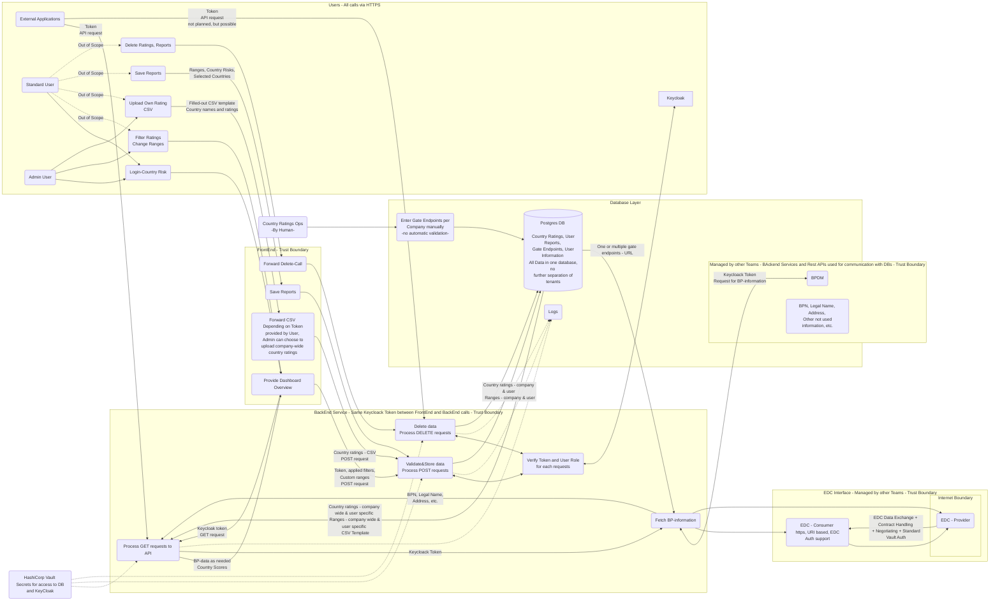

# Security Assessment Country Risk (incl. Frontend, Backend Services)

| Contact                  | Details                                                                           |
| ------------------------- | ---------------------------------------------------------------------------------------------- |
| Contact for product       | [@fabiodmota](https://github.com/fabiodmota) |
| Security responsible      | [@SSIRKC](https://github.com/SSIRKC)   [@szymonkowalczykzf](https://github.com/szymonkowalczykzf) |
| Version number of product | 24.03                                                                                         |
| Dates of assessment       | 2024-01-31: Re-Assessment                                                                      |
| Status of assessment      | RE-ASSESSMENT DONE                                                                            |

## Product Description
Country risk refers to the risk of investing or lending money in a country, arising from possible changes in the business environment that may adversely affect operating profits or the value of assets in the country. 
For example, financial factors such as currency controls, devaluation or regulatory changes, or stability factors such as mass riots, civil war and other potential events contribute to companies' operational risks. 
This term is also sometimes referred to as political risk - however, country risk is a more general term that generally refers only to risks affecting all companies operating within or involved with a particular country.

Political risk analysis providers and credit rating agencies use different methodologies to assess and rate countries' comparative risk exposure. 
Credit rating agencies tend to use quantitative econometric models and focus on financial analysis, whereas political risk providers tend to use qualitative methods, focusing on political analysis. 
However, there is no consensus on methodology in assessing credit and political risks.

## Kick-Off, Basic Information, Scope
* Main Components: Country Risk Frontend, Backend and database
* Technology Stack: Frontend (React: JS, CSS), Backend (Spring Boot: Java), Database (Postgres)
* In Scope: Frontend, Backend incl. connection to BPDM and data validation, user rights & roles (provided by keycloak)
* Out of Scope: Cleaning/filtering company data (e.g. BPN, address, etc.)/BPDM, Keycloak

## Data Flow Diagram

## Data Flow Diagram - Prepared with Mermaid

## Vulnerabilities & Threats
| V001 | 	Risks from Logging: Repudiation, Compromised Audit Capabilities |
| ------------------------- | ------------------------- |
| Element | API Post & Delete Requests |
| Before Mitigation | Impact: Medium, Likelihood: High, Risk: Medium |
| After Mitigation | Impact: Low, Likelihood: Low, Risk: Low |
| Mitigation | Recommendation to also log who did an action. Log readers can come under attack via log files. Consider ways to canonicalize data in all logs. Implement a single reader for the logs, if possible, in order to reduce attack surface area. Be sure to understand and document log file elements which come from untrusted sources. |

| V002 | 	Cross Site Request Forgery (CSRF) |
| ------------------------- | ------------------------- |
| Element | Frontend |
| Before Mitigation | Impact: Medium, Likelihood: Medium, Risk: Medium |
| After Mitigation | Impact: Medium, Likelihood: Low, Risk: Low |
| Mitigation | Implement a CSFR Token which is only know to the backend service and the client to avoid valid requests from outsiders. |

| V003 | 	Potential Crash of Backend-Services |
| ------------------------- | ------------------------- |
| Element | 	API Backend Processes |
| Before Mitigation | Impact: Medium, Likelihood: High, Risk: Medium |
| After Mitigation | Impact: Medium, Likelihood: Low, Risk: Low |
| Mitigation | Request limiting and horizontal scaling in Kubernetes → not a task for BPDM team |

| V004 | Single data store for all companies |
| ------------------------- | ------------------------- |
| Element | Postgres Database |
| Before Mitigation | Impact: Low, Likelihood: Low, Risk: Low |
| After Mitigation | Impact: Low, Likelihood: Low, Risk: Low |
| Mitigation | No highly sensitive data (like BP-information) stored in database. Only ratings stored in database. Consider using a multi-tenant architecture for the data store. |

| V004 | Unnecessary retrieval of BPDM parameters |
| ------------------------- | ------------------------- |
| Element | BPDM connection |
| Before Mitigation | Impact: Medium, Likelihood: Low, Risk: Low |
| After Mitigation | Impact: Low, Likelihood: Low, Risk: Low |
| Mitigation | Only request data which is necessary for the business process of the application. If no other endpoint/parameter filtering is possible in the request, inform the endpoint responsibles. |
